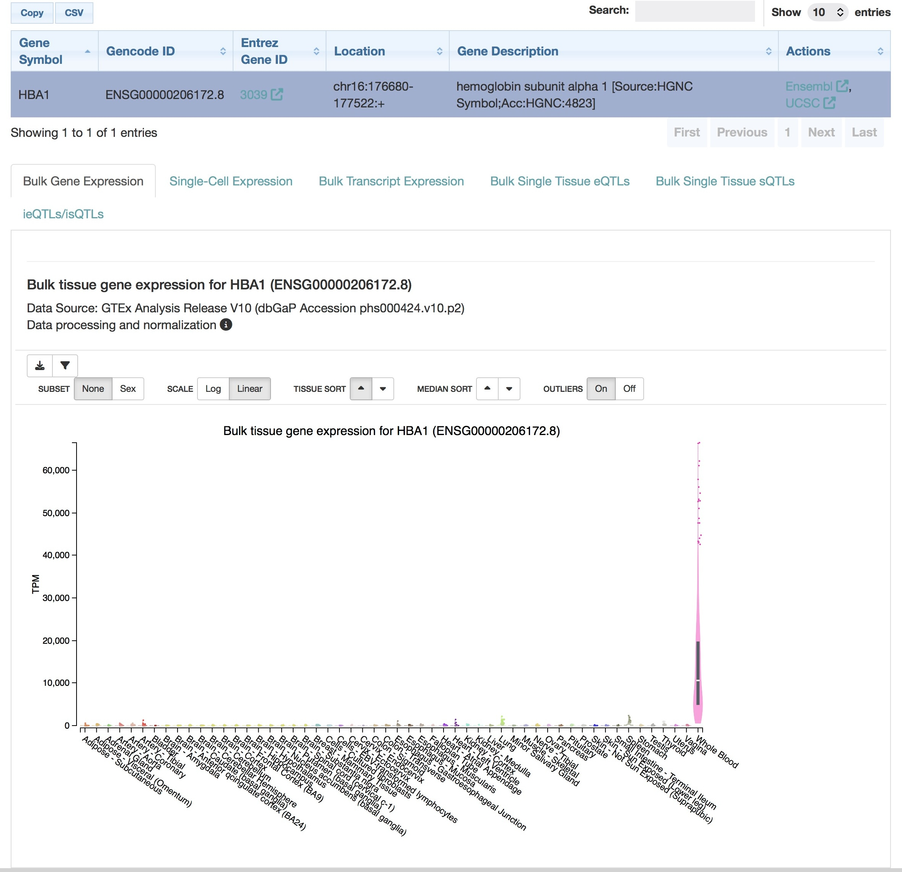

# Gene Expression Analysis Using GTEx

## 📌 Overview
This project explores tissue-specific gene expression patterns of the human HBA1 gene using the GTEx Portal database to investigate how gene expression varies across different human tissues.

## 🔬 Method
- Used the GTEx Portal database
- Searched for the human HBA1 gene
- Examined tissue-specific expression levels across multiple human tissues
- Interpreted expression patterns based on TPM values

## 📊 Key Findings
- HBA1 expression was extremely high in whole blood tissue
- Most other tissues showed very low expression levels
- The observed expression pattern was consistent with the biological role of HBA1 in hemoglobin formation and oxygen transport

## 🧠 Biological Interpretation
The strong expression of HBA1 in blood tissue reflects its essential role in red blood cells and oxygen transport. Low expression in other tissues demonstrates tissue-specific regulation of gene expression.

This analysis highlights how transcriptomics databases can help connect genes with their biological functions and tissue specificity.

## 🛠 Skills Demonstrated
- Gene expression analysis
- Transcriptomics data interpretation
- Tissue-specific expression profiling
- Biological data interpretation
- Use of GTEx Portal database

## 📁 Project Files
- PDF report with detailed explanation
- GTEx expression profile screenshot

## 📸 GTEx Expression Profile

